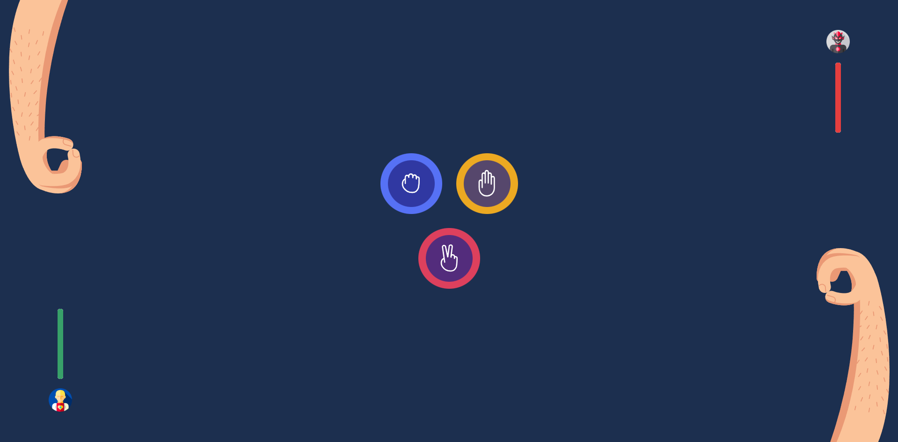

# Rock paper scissors

## Table of contents

- [Overview](#overview)
  - [Screenshot](#screenshot)
  - [Links](#links)
- [My process](#my-process)
  - [Built with](#built-with)
  - [What I learned](#what-i-learned)
- [Author](#author)

## Overview

### Screenshot

### Links

- [Solution URL](https://github.com/klekwedge/rock-paper-scissors)
- [Live Site URL](https://klekwedge-rock-paper-scissors.vercel.app/)

## My process

### Built with

- React
- TypeScript
- Chakra UI
- SCSS
- Vite

### What I learned

I understood how the logic of the game rock-paper-scissors is created.

## Author

- [Website](https://klekwedge-cv.vercel.app/)
- [Linkedin](https://www.linkedin.com/in/klekwedge/)
- [Facebook](https://www.facebook.com/klekwedge)
