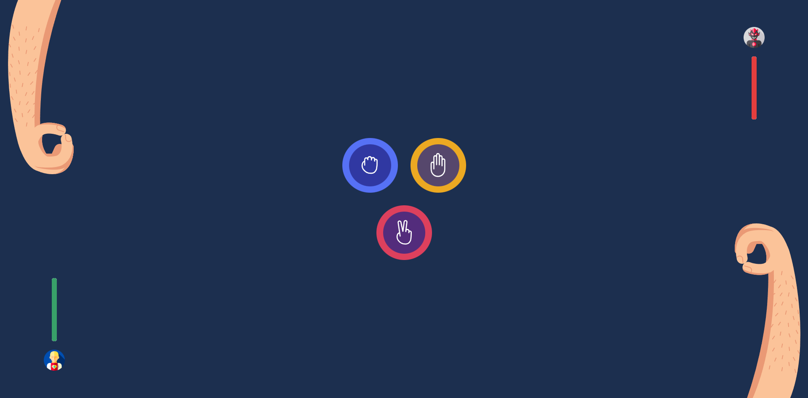

# Rock paper scissors

You can also read this README in [русский](https://github.com/klekwedge/rock-paper-scissors/blob/main/README.RU.md)

## Table of contents

- [Deployment instructions](#deployment-instructions)
- [Overview](#overview)
  - [Screenshot](#screenshot)
  - [Links](#links)
- [My process](#my-process)
  - [Built with](#built-with)
  - [What I learned](#what-i-learned)
- [Author](#author)

## Deployment instructions

**To run the project, you need to have [npm](https://nodejs.org/en/) and [git](https://git-scm.com/downloads) installed on your computer**

1. Make a clone of this repository ```git clone https://github.com/klekwedge/rock-paper-scissors.git```
2. Install all required npm packages with ```npm i```
3. Run the project with the command ```npm run dev```

## Overview

### Screenshot



### Links

- [Solution URL](https://github.com/klekwedge/rock-paper-scissors)
- [Live Site URL](https://klekwedge-rock-paper-scissors.vercel.app/)

## My process

### Built with

- React
- TypeScript
- Chakra UI
- SCSS
- Vite

### What I learned

I understood how the logic of the game rock-paper-scissors is created.

## Author

- [Website](https://klekwedge-cv.vercel.app/)
- [Linkedin](https://www.linkedin.com/in/klekwedge/)
- [Facebook](https://www.facebook.com/klekwedge)
